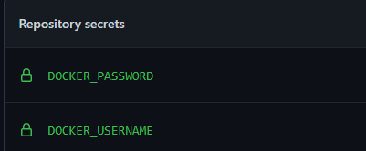
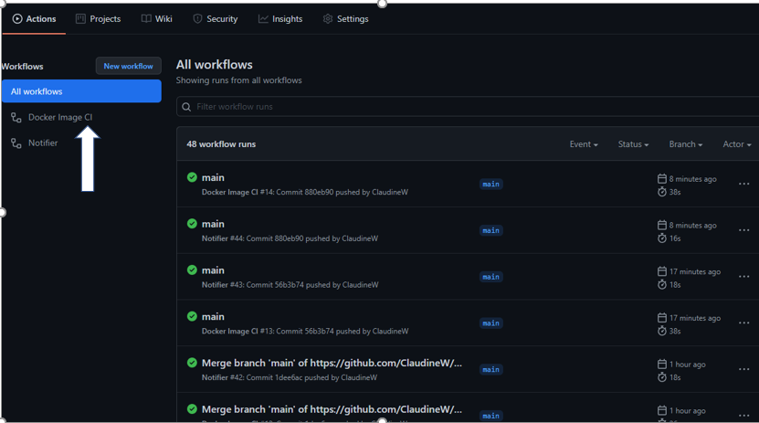
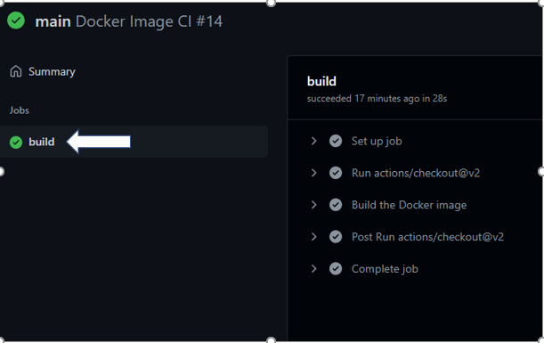
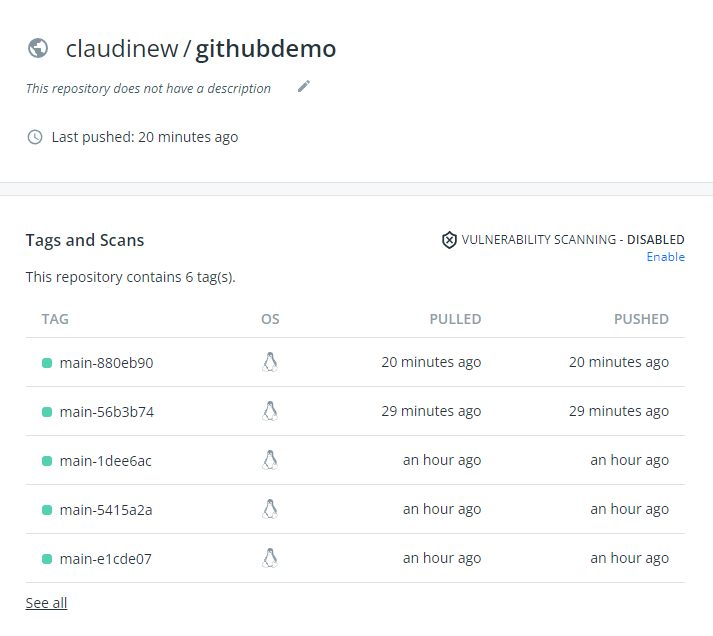
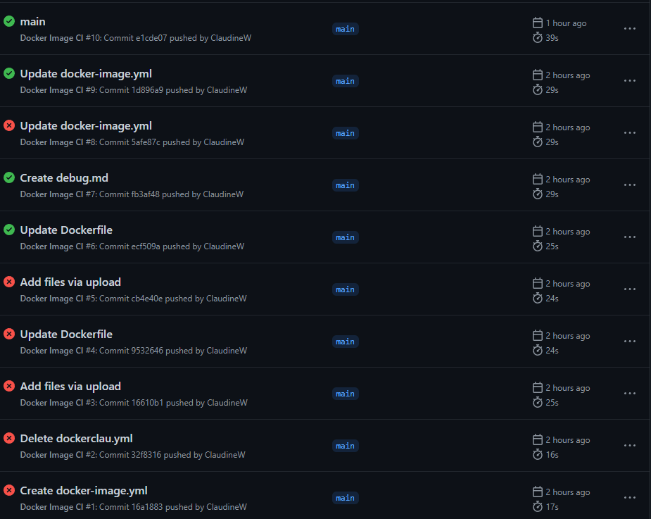
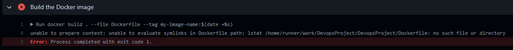
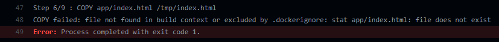
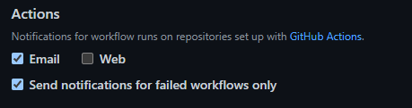
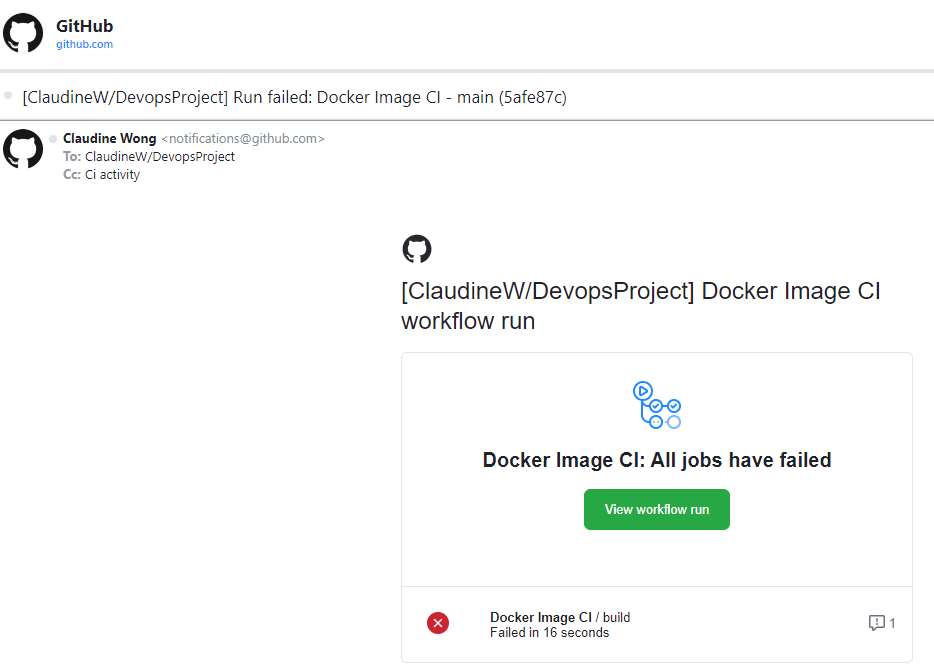

## Pushing Images from GitHub into DockerHub.

## Links

* [Docker Hub](https://hub.docker.com/)

## **Step 1**

Create an account in [Docker Hub](https://hub.docker.com/).

## **Step 2**

In GitHub, create a new workflow using the suggested template - "Docker Image".

## **Step 3**

In the docker-image.yml, add on "Mr Smither Build and Push" package so that the new image can be push to DockerHub.
Then click on "Start commit".

## **Step 4**

To insert DOCKER_USERNAME and DOCKER_PASSWORD, click on "Setting", then "Secrets".

## **Step 5**

Click on "Actions", then "New Repository Secrets".

## **Step 6**

Provide a name for the "secret". The name to the "secret" needs to be the same as the source code.
Insert the value. Click "Add secret".
Do the same for both Chat ID and Token.

## **Step 7**

Back to "Action" Tab, click on the workflow.

## **Step 8**

The action has been run.
A green tick appear if it is a successful run.

An Image will be push to DockHub.

## Debugging docker-image workflow step by step.

A few rounds of debugging before the workflow become successful.

One Example of error: Missing Dockerfile (line 4)

Another example of error: Wrong path for index.html (Line 48)

## Set Email alert for failed run.

Click the dropdown at your profile logo. Setting > Notifications > Actions.

Sample of a failed run.

