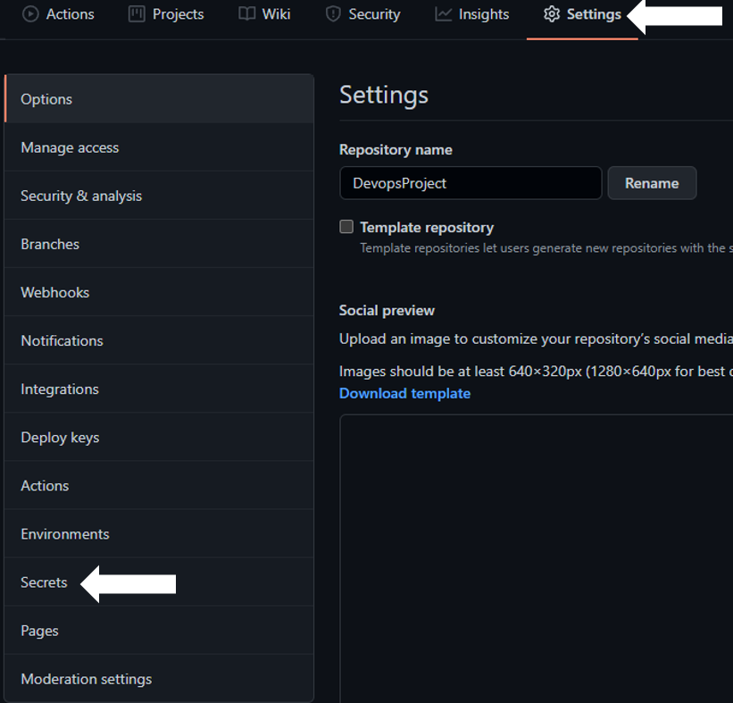
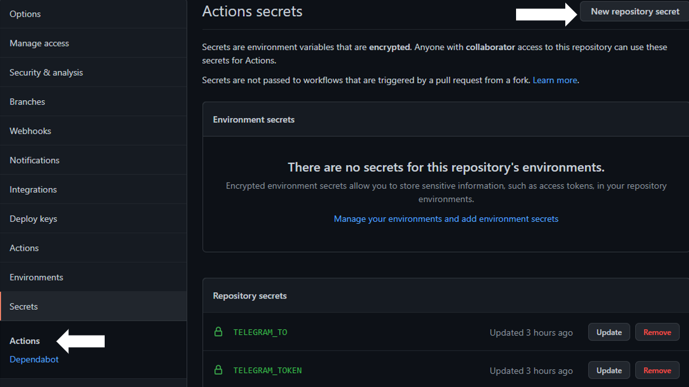
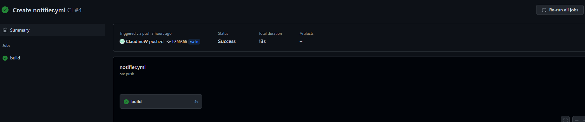
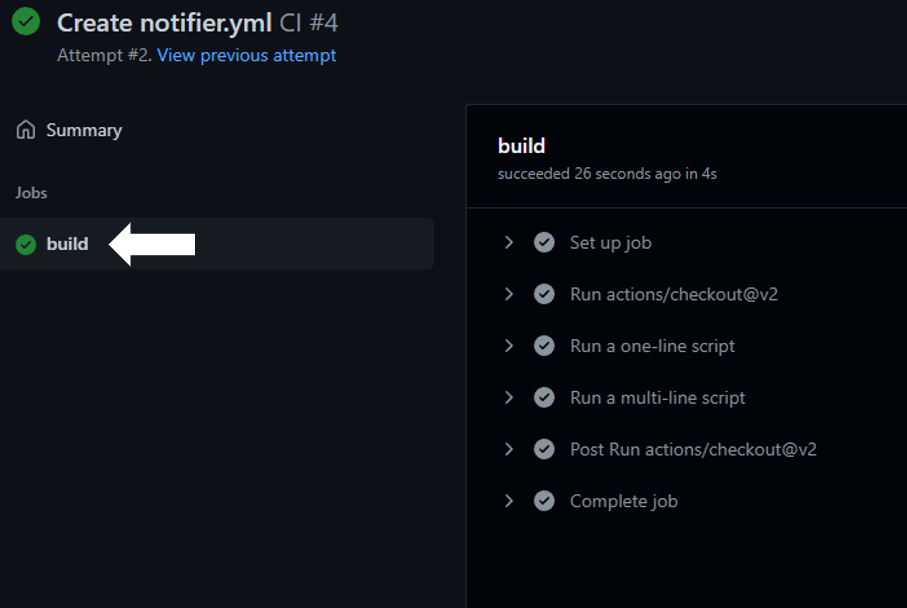

## Pushing image from GitHub into DockerHub.

## Links

* [Docker Hub](https://hub.docker.com/)

## **Step 1**

Create an account in [Docker Hub](https://hub.docker.com/).

## **Step 2**

In GitHub, create a new workflow using the suggested template - "Docker Image".

## **Step 3**

In the docker-image.yml, add on "Mr Smither Build and Push" package so that the new image can be push to DockerHub.
Then click on "Start commit".

## **Step 4**

To insert hat ID and Token, Click on "Setting", then "Secrets".

## **Step 7**

Click on "Actions", then "New Repository Secrets".

## **Step 8**

Provide a name for the "secret". The name to the "secret" needs to be the same as the source code.
Insert the value. Click "Add secret".
Do the same for both Chat ID and Token.

## **Step 9**

Back to "Action" Tab, click on the workflow.

## **Step 10**

Run the action.

A green tick appear if it is a successful run.

A notification message will be sent to Telegram Bot when there is a push to the repository.

