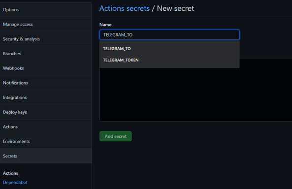

## Creating an action in GitHub for Telegram to notify me when there is an event to the repository.

## Links

* [Telegram Channel](https://t.me/StayAliveClauAlways_bot)

## **Step 1**

Creating a new repository.

## **Step 2**

After new repository has been created, click on "Setting", "Actions" then "New workflow".

## **Step 3**

Creating a new workflow for youself.

## **Step 4**

Key in the workflow name and click on "Start commit".

## **Step 5**

Insert source code and click "Commit New File".

## **Step 6**

To insert Chat ID and Token, Click on "Setting", then "Secrets".
[Click Here](https://claudinew.github.io/DevopsProject/exercises.html) on how to obtain the Chat ID and Token.

## **Step 7**

Click on "Actions", then "New Repository Secrets".

## **Step 8**

Provide a name for the "secret". The name to the "secret" needs to be the same as the source code.
Insert the value. Click "Add secret".
Do the same for both Chat ID and Token.

## **Step 9**

Back to "Action" Tab, click on the workflow.

## **Step 10**

The action has been run.

A green tick appear if it is a successful run.

A notification message will be sent to Telegram Bot when there is a push to the repository.

