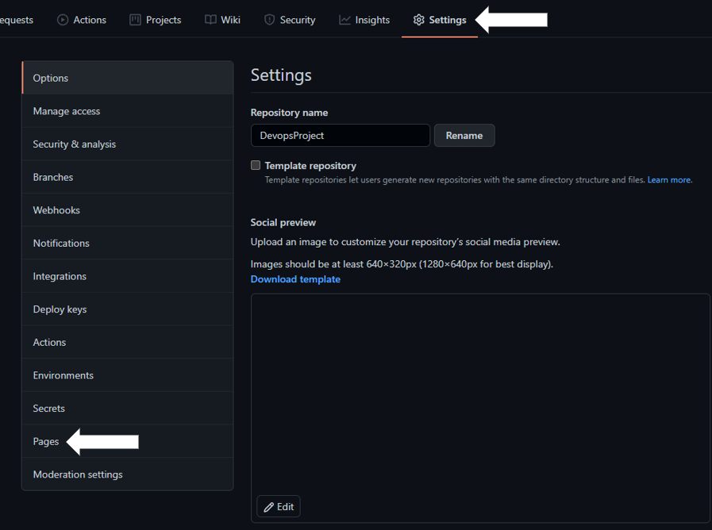

# This is create for the Dev Ops Project

###Steps in creating a website using GitHub Pages

####**Step1**

####Creating a new repository

###**Step2**

####Afthe new repository has been created, click on "Setting", the "Pages

####Setting up the configuration