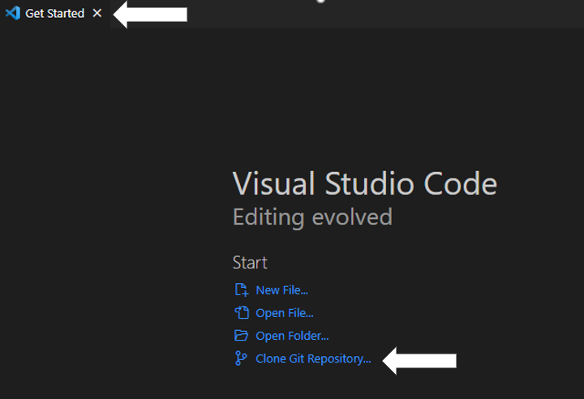
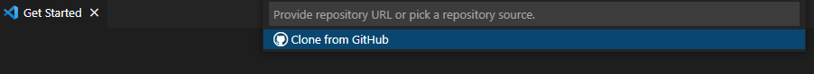
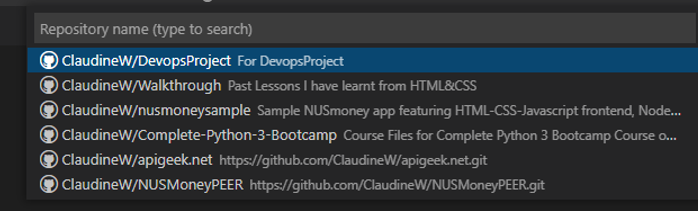
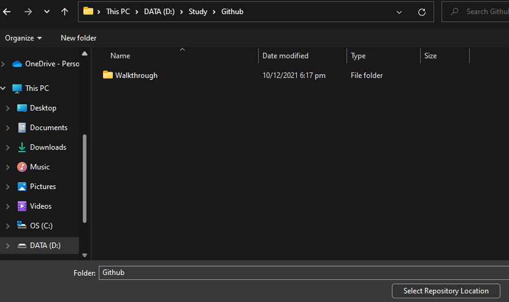
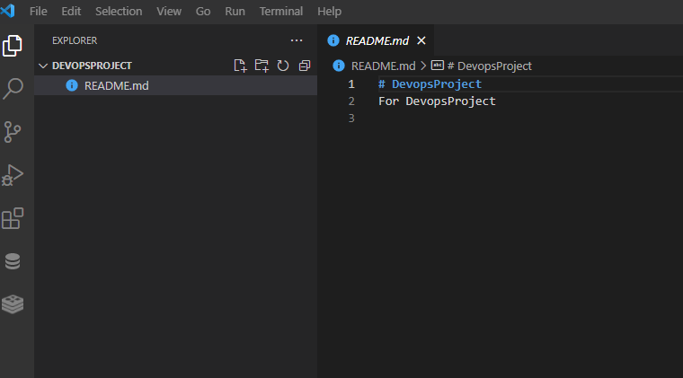

# This is create for the Dev Ops Project

## Links

* [Markdown Basic Syntax](https://www.markdownguide.org/basic-syntax/)

## Steps in creating a website using GitHub Pages

## **Step 1**

Creating a new repository.

## **Step 2**

After new repository has been created, click on "Setting", then "Pages".

## **Step 3**

Creating URL using GitHub Pages.

Key in the URL into the browser to view the homepage.

## Steps in cloning GitHub Repository into VS Code

## **Step 1**

In the "Get Started" Tab in VS Code, click "Clone Git Repository".

A Dropdown menu will appear.

Click on "Clone from GitHub".

## **Step 2**

Click on the repository that needs to be clone.

## **Step 3**

Select the location to save in local.

The README.md file is now clone to VS Code.

