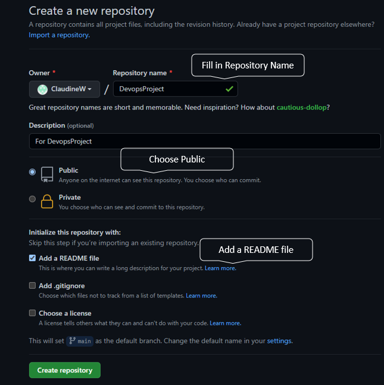

# This is create for the Dev Ops Project

## Links

* [Markdown Basic Syntax](https://www.markdownguide.org/basic-syntax/)

## Steps in creating a website using GitHub Pages

### **Step 1**

Creating a new repository.

### **Step 2**

After new repository has been created, click on "Setting", then "Pages.

### **Step 3**

Creating URL using GitHub Pages.

Key in the URL into the browser to view the homepage.

